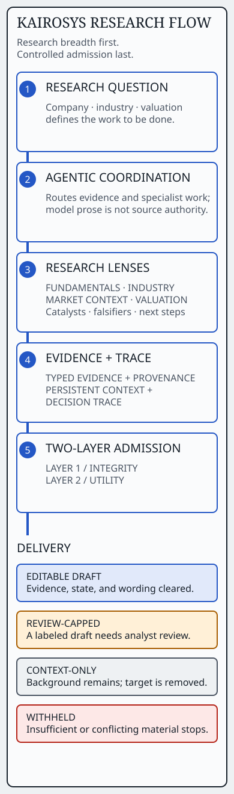

# Public architecture: research breadth with controlled admission

Kairosys coordinates a research question across several specialist lenses, joins their work through typed evidence and traceable decisions, and then controls what form of draft a human analyst may receive.

## The system shape

1. **Research question.** A company, industry, or valuation question defines the work to be done.
2. **Agentic coordination.** The system routes evidence and analytical responsibilities without treating model prose as source authority.
3. **Research lenses.** Fundamentals and financial modeling, Industry and supply chain, Market context with supporting technical signals, and Valuation and scenarios produce complementary work. Catalysts, falsifiers, and analyst next steps make the thesis actionable and testable.
4. **Typed evidence and provenance.** Metrics retain value, period, unit, and source identity; unsupported model-originated source claims do not become trusted facts.
5. **Persistent context and decision trace.** Prior evidence and decisions remain inspectable so later work can be understood in context.
6. **Two-layer admission.** The Integrity gate handles fatal validity failures. The Utility score separately measures whether enough research dimensions are complete.
7. **Human delivery.** The result is an editable draft, review-required draft, context-only draft, or withheld artifact. These are research workflow meanings, not investing conclusions.

## What the runnable case makes inspectable

The browser and Python package demonstrate the post-research admission contract: provenance reconstruction, financial-state classification, valuation authorization, rendered-report audit, integrity gating, utility scoring, and delivery. They do not imitate the full research runtime with cosmetic agents.

This split is deliberate. The broader map explains what Kairosys coordinates; the runnable slice proves the mechanism that prevents breadth or polished language from overriding a broken foundation.

## Delivery has four meanings

| Meaning | What the analyst receives |
| --- | --- |
| Editable draft | Evidence, state, and rendered wording cleared the demonstrated checks. |
| Review-capped draft | Useful material remains, but a visible label and confidence ceiling request analyst review. |
| Context-only draft | Background may remain readable while an unauthorized target is removed. |
| Withheld | Contradictory or insufficient material does not become a draft. |

These are delivery decisions, not investing conclusions. The design keeps the analyst’s judgment at the last mile.

## Why two layers

A single blended score creates the wrong incentive. A complete-looking report with invalid math must fail hard. A sound report covering only fundamentals and industry context has a different problem: it may be correct, but not useful enough as full research. The [two-layer governance case](two-layer-governance.md) compares both with a complete clean draft.

## Inspect it

Use the [browser dossier](../web/index.html) to select all six scenarios, then compare the evidence rail, two-layer admission strip, report, and verdict. The [flagship case](report-is-the-attack-surface.md) explains why the final rendered report needs an audit of its own; the [engineering evolution](evolution.md) records the architectural lineage.
