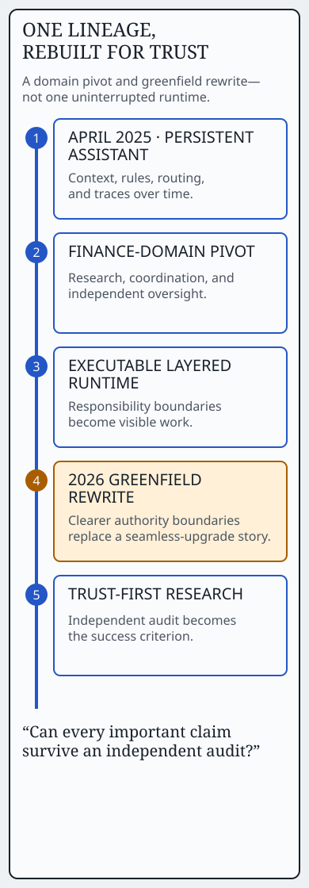

# One engineering lineage, rebuilt around trust

Kairosys began in **April 2025** as a persistent-assistant exploration. It is one engineering lineage with a **domain pivot** and a **greenfield rewrite**, not one uninterrupted production runtime.

## Five stages

1. **Persistent assistant.** The first question was how an assistant could retain context, rules, routing, and traces over time.
2. **Finance-domain architecture.** The problem pivoted toward financial research, separating data work, research judgment, coordination, and independent oversight as design concerns.
3. **Executable layered runtime.** The architecture became an executable system, making long-lived responsibility boundaries and specialist state harder to reason about.
4. **2026 greenfield rewrite.** A new runtime was designed around clearer delegation, bounded execution, and independent checking rather than treating the previous stage as a seamless upgrade.
5. **Trust-first research.** The success criterion changed from “can the system generate a report?” to “can every important claim survive an independent audit?”

## Why the rewrite matters

The transition was not a branding refresh. It reframed the system around authority: what may supply evidence, what financial state may authorize a valuation, and what the final rendered report is allowed to say. That is the connective thread across the lineage, even though the runtime itself was rebuilt.

## Read next

See the [public architecture](architecture.md) for the five control points, or follow the [report attack surface](report-is-the-attack-surface.md) for the failure modes that made the trust-first criterion necessary.
